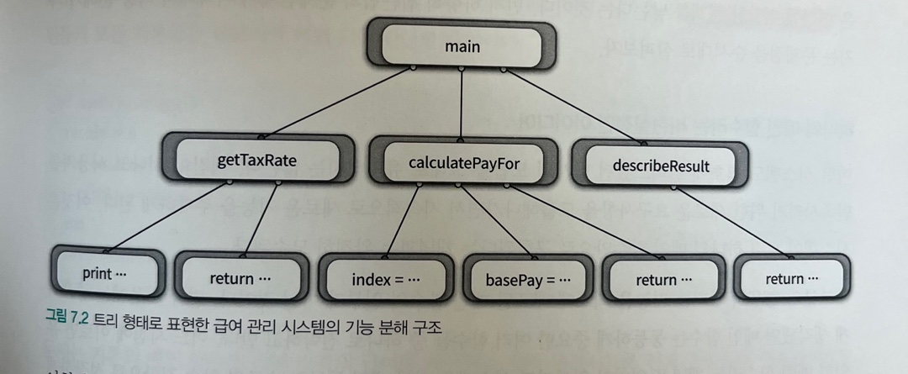
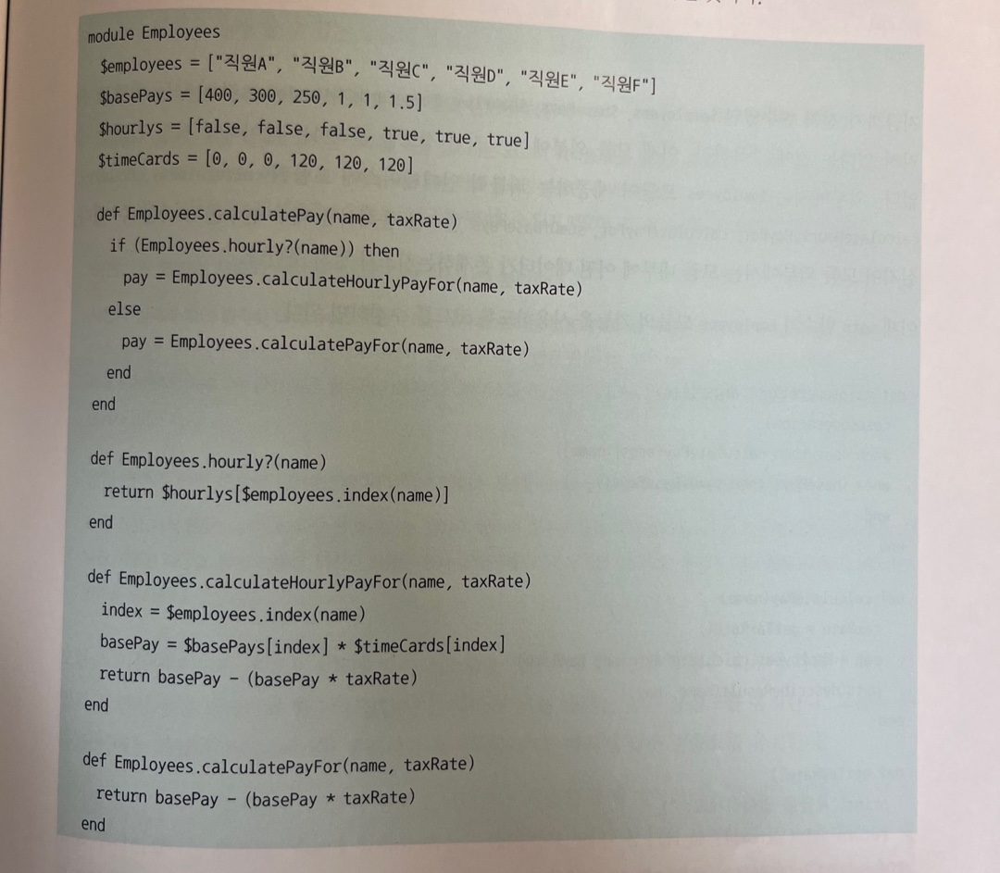
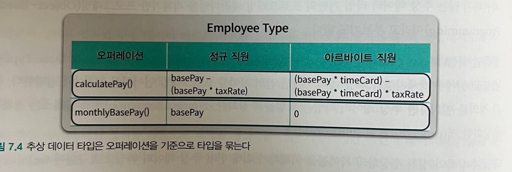
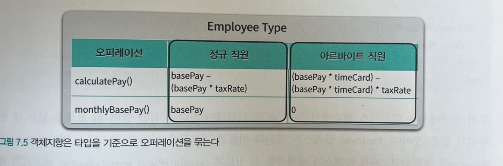
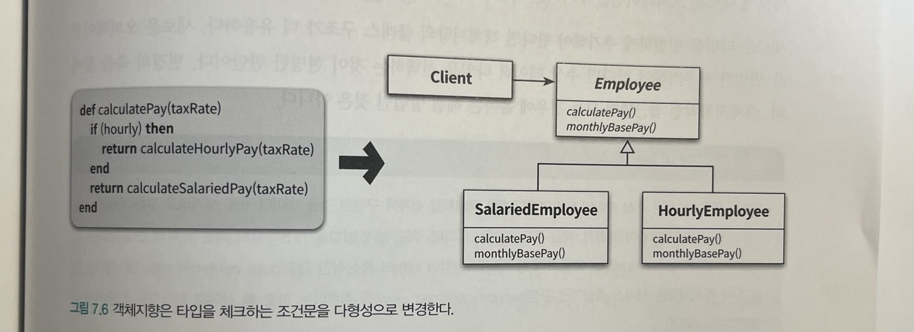

## CH07 객체 분해

**추상화**와 **분해**는 인간들이 복잡한 문제를 해결하는 가장 기본적인 사고 도구이다. 하나의 큰 문제를 해결 가능한 작은 문제로 나누는 것을 **분해**라고 하며, 이렇게 불필요한 정보를 제거하고 현재의 문제 해결에 필요한 핵심만 남기는 것을 **추상화**라고 한다.

일상의 문제뿐 아니라 소프트웨어 개발 영역에서도 추상화와 분해의 기법이 사용된다.

## 01 프로시저 추상화와 데이터 추상화

객체지향은 추상화와 분해의 개념을 사용해 복잡한 문제를 극복하는 프로그래밍 패러다임이다.

객체지향 패러다임을 역할과 책임을 수행하는 자율적인 객체들의 협력 공동체를 구축하는 것으로 설명했다. 여서 **역할과 책임을 수행하는 객체**가 객체지향 패러다임이 이용하는 추상화다. 기능을 **협력하는 공동체**를 구성하도록 객체들로 나누는 과정이 바로 객체지향 패러다임에서의 분해를 의미한다.

객체지향의 추상화 메커니즘과 분해 방법이 효과적이라는 말에 담긴 진정한 의미는 무엇일까? 질문의 해답을 찾기 위해 전통적인 기능 분해 방법에서 시작해 객체지향 분해 방법에 이르는 과정에서의 역사를 살펴보자.

## 02 프로시저 추상화와 기능 분해

### 메인 함수로서의 시스템

오랜 시간 동안 시스템을 분해하기 위한 기준으로 사용된 분해 방식은 **알고리즘 분해** 또는 **기능 분해**라고 부른다. 기능 분해의 관점에서 추상화의 단위는 **프로시저**이며 시스템은 프로시저 단위로 분해된다.

프로시저는 반복적으로 실행되거나 거의 유사하게 실행되는 작업들을 하나의 장소에 모아놓음으로써 로직을 재사용하고 중복을 방지할 수 있는 추상화 방법이다.

프로시저 중심의 기능 분해 관점에서 시스템은 필요한 더 작은 작업으로 분해될 수 있는 하나의 커다란 **메인 함수**이다.

전통적인 기능 분해 방법은 하향식 접근법(Top-Down Approach)를 따른다. 시스템을 구성하는 가장 최상위를 정의하고, 이 최상위 기능을 좀 더 작은 단계의 하위 기능으로 분해해 나가는 방법이다.

### 급여 관리 시스템

급여 관리 시스템의 최상위 문장은 다음과 같다. 이 문장은 급여 관리 시스템을 시작하는 메인 프로시저로 구현된다.

```
직원의 급여를 계산한다
```

기능 분해 방법에 따라 이 프로시저를 더 세분화하면 다음과 같다.

```
직원의 급여를 계산한다
    사용자로부터 소득세율을 입력받는다
        "세율을 입력하세요: "라는 문장을 화면에 출력한다
        키보드를 통해 세율을 입력받는다
    직원의 급여를 계산한다
        전역변수에 저장된 직원의 기본급 정보를 얻는다
        급여를 계산한다
    양식에 맞게 결과를 출력한다
        "이름: {직원명}, 급여: {계산된 금액}" 형식에 따라 출력 문자열을 생성한다
```

### 급여 관리 시스템 구현



하향식 기능 분해는 시스템을 최상위의 가장 추상적인 메인 함수로 정의하고, 메인 함수를 구현 가능한 수준까지 세부적인 단계로 분해한다.

### 하향식 기능 분해의 문제점

- 시스템은 하나의 메인 함수로 구성돼 있지 않다.
- 기능 추가나 요구사항 변경으로 인해 메인 함수를 빈번하게 수정해야 한다.
- 비즈니스 로직이 사용자 인터페이스와 강하게 결합된다.
- 하향식 분해는 너무 이른 시기에 함수들의 실행 순서를 고정시키기 때문에 유연성과 재사용성이 저하된다.
- 데이터 형식이 변경될 경우 파급효과를 예측할 수 없다.

**하나의 메인 함수라는 비현실적인 아이디어**

대부분의 현대적인 시스템에서 하나의 메인 기능이란 존재하지 않는다. 모든 기능들은 규모라는 측면에서 차이가 있을 수는 있겠지만 기능성의 측면에서는 동등하게 독립적이고 완결된 하나의 기능을 표현한다. 메인 함수가 있다면, 처음에는 중요하게 생각되었더라도 기능이 추가되면서 동등하게 중요한 여러 함수들 중 하나로 전락하고 만다.

**메인 함수의 빈번한 재설계**

급여 관리 시스템에 회사에 속한 모든 직원들의 기본급의 총합을 구하는 기능을 추가한다고 하자.

$basePays에 저장돼 있는 직원들의 모든 기본급을 더하는 간단한 함수 sumOfBasePays()를 만들 수 있다. 문제는 메인 함수에 이 함수가 들어설 자리가 마땅치 않다는 것이다.

따라서 현재의 메인 함수의 로직 전체를 calculatePay라는 함수로 추출한 후 main 함수에서 적절하게 sumOfBasePays 함수와 calculatePay 함수를 호출한다.

```
def main(operation, args={})
    case(operation)
    when :pay then calculatePay(args[:name])
    when :basePays then sumOfBasePays()
    end
end
```

이와 같이 시스템은 여러 개의 정상(top)으로 구성되기 때문에 새로운 정상이 추가될 때마다 메인 함수의 내부 구현을 수정할 수 밖에 없다. 결과적으로 기존 코드의 빈번한 수정으로 인한 버그 발생 확률이 높아지기 때문에 시스템은 변경에 취약해질 수 밖에 없다.

**비즈니스 로직과 사용자 인터페이스의 결합**

비즈니스 로직과 사용자 인터페이스가 변경되는 빈도가 다르다. 사용자 인터페이스가 비즈니스 로직에 비해 더 자주 변경된다. 하향식 접근법은 사용자 인터페이스와 비즈니스 로직을 한데 섞기 때문에 사용자 인터페이스를 변경하는 경우 비즈니스 로직까지 변경에 영향을 미치게 되어 불안정한 아키텍처를 낳는다.

**성급하게 결정된 실행 순서**

하향식 접근법은 설계를 시작하는 시점부터 시스템이 무엇(what)을 해야 하는지가 아니라 어떻게(how) 동작해야 하는지 집중하게 한다. 이는 구현을 염두에 두기 때문에 자연스럽게 함수들의 실행 순서를 정의하는 시간적 제약(temporal constrain)를 강조한다.

함수는 함께 절차를 구성하는 다른 함수들과 시간적으로 강하게 결합돼 있다. 강한 결합도는 시스템을 변경에 취약하게 만들고 이해하기 어렵게 만든다.

이를 해결하기 위해 객체지향처럼 논리적 제약(logical constraint)를 설계의 기준으로 삼을 수 있다. 객체지향은 함수 간의 호출 순서가 아니라 객체 사이의 논리적인 관계를 중심으로 설계를 이끌어 나간다.

**데이터 변경으로 인한 파급효과**

하향식 기능 분해의 가장 큰 문제점은 어떤 데이터를 어떤 함수가 사용하고 있는지 추적하기 어렵다는 것이다. 따라서 데이터 변경으로 인해 어떤 함수가 영향을 받을지 예상하기 어렵다. 이는 의존성과 결합도의 문제이며 더 나아가 테스트의 문제이기도 하다.

데이터 변경으로 인한 영향을 최소화하려면 데이터와 함께 변경되는 부분과 그렇지 않은 부분을 명확하게 분리해야 한다. 이를 위해 데이터와 함께 변경되는 부분을 하나의 구현 단위로 묶고 외부에서는 제공되는 함수만 이용해 데이터에 접근해야 한다. 이러한 개념은 **정보 은닉**과 **모듈**이라는 개념으로 이어진다.

### 언제 하향식 분해가 유용한가?

> 하향식은 이미 완전히 이해된 사실을 서술하기에 적합한 방법이다 ... 그러나 하향식은 새로운 것을 개발하고, 설계하고, 발견하는 데는 적합한 방법이 아니다. 이것은 수학과 아주 유사하다. 수학 교과서는 계산의 과정을 논리적인 순서로 서술한다. 그러나 이론은 그런 방식이나 순서로 개발되거나 발견되는 것은 아니다.

## 03 모듈

기능 기반으로 시스템을 분해하는 접근법의 문제를 해결하기 위해서는 **변경의 방향에 맞춰** 시스템을 분해해야 한다. 

정보 은닉은 시스템을 모듈 단위로 분해하기 위한 기본 원리로 시스템에서 자주 변경되는 부분을 상대적으로 덜 변경되는 안정적인 인터페이스 뒤로 감춘다.

급여 관리 시스템에서는 모듈을 이용해 직원 정보라는 비밀을 감추고 외부에 대해서는 퍼블릭 인터페이스만 노출시켜야 한다. 다음과 같이 전체 직원에 관한 처리를 Employees 모듈로 캡슐화할 수 있다.



### 모듈의 장점과 한계

**모듈 내부의 변수가 변경되더라도 모듈 내부에만 영향을 미친다**

모듈을 사용하면 모듈 내부에 정의된 변수를 직접 참조하는 코드의 위치를 모듈 내부로 제한할 수 있다. 따라서 어떤 데이터가 변경됐을 때 모든 함수를 분석할 필요 없이 해당 데이터를 정의한 모듈만 검색하면 된다. 코드를 수정하고 디버깅하기 쉬워진다.

**비즈니스 로직과 사용자 인터페이스에 대한 관심사를 분리한다**

수정된 코드에서 Employees 모듈은 비즈니스 로직과 관련된 관심사만 담당하며 사용자 인터페이스와 관련된 관심사는 모두 main 함수쪽에 위치한다. 이제 GUI 같은 다른 형식의 사용자 인터페이스를 추가하더라도 Employees 내부에 포함된 비즈니스 로직은 변경되지 않는다.

**전역 변수와 전역 함수를 제거함으로써 네임스페이스 오염을 방지한다**

변수와 함수를 모듈 내부에 포함시키기 때문에 다른 모듈에서도 동일한 이름을 사용할 수 있다. 모듈은 전역 네임스페이스의 오염을 방지하는 동시에 이름 충돌의 위험을 완화한다.

비록 모듈이 프로시저 추상화보다는 높은 추상화 개념을 제공하지만 가장 큰 단점은 인스턴스의 개념을 제공하지 않는다는 점이다. Employees 모듈은 회사에 속한 모든 직원 정보를 가지고 있다. 좀 더 높은 추상화를 위해서는 직원 전체가 아니라 개별 직원을 독립적인 단위로 다룰 수 있어야 한다. 이를 만족시키기 위해 등장한 개념이 **추상 데이터 타입**이다.

## 04 데이터 추상화와 추상 데이터 타입

사람들은 '직원의 급여를 계산한다'라는 커다란 절차를 이용해 사고하기보다는 '직원'과 '급여'라는 추상적인 개념들을 떠올린 후 '계산'에 필요한 절차를 생각한다. 추상 데이터 타입은 프로시저 추상화 대신 데이터 추상화를 기반으로 소프트웨어를 개발하게 한 최초의 발걸음이다.

급여 관리 시스템 예제에서 $employees, $basePays, $hourlys, $timeCards라는 4가지 전역 변수를 사용했다. 이들은 각각 직원의 이름, 기본급, 아르바이트 직원 여부, 아르바이트 직원일 경우 한달 간 작업 시간을 의미하는 4개의 데이터 항목을 나타낸다. 이를 루비의 Struct를 이용해 구현하면 다음과 같다.

```
Employee = Struct.new(:name, :basePay, :hourly, :timeCard) do

End
```

내부에는 직원 유형에 따라 급여를 계산하는 calculatePay 오퍼레이션과 개별 직원의 기본급을 계산하는 monthlyBasePay() 오퍼레이션을 구현한다.

이처럼 개별 직원의 인스턴스를 생성할 수 있는 Employee 추상 데이터 타입은 전체 직원을 캡슐화했던 Employee 모듈보다는 좀 더 개념적으로 사람들의 사고방식에 가깝다.

추상데이터 타입 정의를 기반으로 객체를 생성하는 것은 가능해졌지만 여전히 데이터와 기능을 분리해서 바라본다는 점에 주의하자. 추상 데이터 타입은 시스템의 상태를 저장할 데이터를 표현하지만 이를 이용해 기능을 구현하는 핵심 로직은 여전히 외부에 존재한다.

## 05 클래스

### 클래스는 추상 데이터 타입인가?

명확한 의미에서 추상 데이터 타입과 클래스는 동일하지 않다. 추상 데이터 타입은 타입을 추상화한 것(type abstraction)이고 클래스는 절차를 추상화한 것(procedural abstraction)이다.

**추상 데이터 타입**

Employee 타입은 물리적으로는 하나의 타입이지만 개념적으로는 정규 직원과 아르바이트 직원이라는 두 개의 개별적인 개념을 포함하는 복합 개념이다. Employee 타입이 제공하는 퍼블릭 오퍼레이션인 calculatePay()와 monthlyBasePay() 는 직원 유형에 따라 서로 다른 방식으로 동작한다. 추상 데이터 타입은 **오퍼레이션을 기준**으로 타입을 묶는다.



**객체지향**

객체지향은 **타입을 기준으로** 오퍼레이션을 묶는다. 정규 직원과 아르바이트 직원이라는 두 개의 타입을 명시적으로 정의하고 두 직원 유형과 관련된 오퍼레이션의 **실행 절차**를 두 타입에 분배한다.

이때 정규 직원과 아르바이트 직원이라는 두 가지 클래스로 분리할 경우 공통 로직을 어디에 둘 것인지가 이슈가 된다. 공통 로직을 제공하기 위한 가장 간단한 방법은 공통 로직을 포함할 **부모 클래스**를 정의하고 두 직원의 유형의 클래스가 부모 클래스를 상속받게 하는 것이다. 그리고 클라이언트는 부모 클래스의 참조자에 대해 메시지를 전송하며 실제 클래스가 무엇인지에 따라 적절한 절차가 실행된다. 바로 다형성의 개념이다.



### 추상 데이터 타입에서 클래스로 변경하기

Employee 클래스는 추상 데이터 타입과는 다르게 정규 직원과 아르바이트 직원 타입이 공통적으로 가져야 하는 속성과 메서드 시그니처만 정의한다. 추상 클래스로 봐도 무방하다.

```
class Employee
    attr_reader :name, :basePay

    def initialize(name, basePay) 
        @name = name
        @basePay = basePay
    end

    def calculatePay(taxRate)
        raise NotImplementedError
    end

    def monthlyBasePay()
        raise NotImplementedError
    end
end
```

이제 정규 직원 타입인 독립적인 SalariedEmployee 클래스와 아르바이트 직원을 나타내는 HourlyEmployee 클래스를 추가한다.

클라이언트 입장에서는 SalariedEmployee와 HourlyEmployee의 인스턴스를 모두 부모 클래스인 Employee의 인스턴스처럼 다룰 수 있다. 클라이언트는 메시지를 수신할 객체의 구체적인 클래스에 관해 고민할 필요가 없이 그저 메시지만 전송하면 된다.

### 변경을 기준으로 선택하라

객체지향에서는 타입 변수를 이용한 조건문을 다형성으로 대체한다. 추상 데이터 타입을 기반으로 한 Employee에 새로운 직원 타입을 추가하기 위해서는 hourly의 값을 체크하는 클라이언트의 조건문을 하나씩 다 찾아 수정해야 한다. 반면 객체지향은 새로운 직원 유형을 구현하는 클래스를 Employee 상속 계층에 추가하고 필요한 메서드를 오버라이딩하면 된다. 



이처럼 기존 코드에 아무런 영향도 미치지 않고 새로운 객체 유형과 행위를 추가할 수 있는 객체지향의 특성을 개방-폐쇄 원칙(OCP)라고 부른다.

하지만 객체지향의 모든 설계의 정답이라고 생각해서는 안 된다. 설계는 변경과 관련된 것으로 설계의 유용성은 변경의 방향성과 발생 빈도에 따라 결정된다. 새로운 타입을 빈번하게 추가해야 한다면 객체지향의 클래스 구조가 더 유용하다. 새로운 오퍼레이션을 빈번하게 추가해야 한다면 추상 데이터 타입을 선택하는 것이 현명하다.


